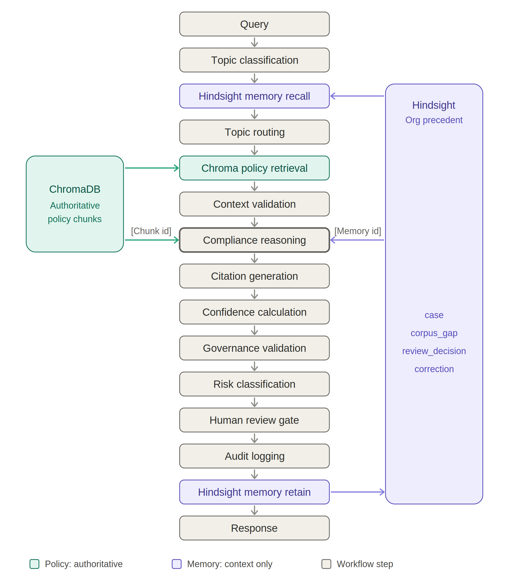
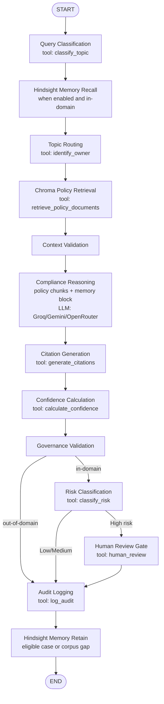

# 🛡️ Aegis — Compliance Advisory & Triage Agent

Aegis is a LangGraph-orchestrated compliance advisory and triage agent. Every user query
executes through a compiled `StateGraph` (see `agents/orchestrator.py`) — Streamlit never
calls the LLM or a retrieval tool directly. The workflow combines authoritative policy
retrieval through ChromaDB with optional organisational-memory recall through Hindsight.
Policy chunks remain the evidence for compliance claims; recalled memories provide
supplementary precedent context. Answers are governed, risk-classified, and routed to the
correct compliance owner, with a human-review gate for in-domain high-risk cases.

---

## Architecture — Policy and Organisational Memory





Memory recall follows topic classification so a known topic can guide the recall query. The
graph keeps recalled memory separate from Chroma policy chunks; compliance reasoning receives
both, but Hindsight items are not authoritative policy evidence and cannot replace `[Chunk]`
citations. Out-of-domain questions bypass risk classification and go from governance to audit
logging. The memory-retain node runs after audit logging and stores eligible outcomes when
memory is enabled. Human review decisions and corrections are retained through their dedicated
review actions in the UI.

---

## What's New in This Release (AEGIS-MEMORY_ADDITION)

This release adds the full organisational-memory layer, authentication, observability
improvements, new utility scripts, and an expanded test suite on top of the original RAG + LangGraph core.

### Memory Module (`memory/`)
- **`memory/hindsight_client.py`** — Low-level client for the Hindsight memory service: `retain`, `recall`, `reflect`, and `is_enabled`. All calls are no-ops when `HINDSIGHT_API_KEY` is absent, so the agent degrades gracefully.
- **`memory/service.py`** — Higher-level helpers consumed by LangGraph nodes and UI components:
  - `recall_for_query` — semantic memory lookup aligned to the query topic (T3)
  - `format_prompt_block` — serialises recalled items into a compact context block for the LLM
  - `retain_case` — stores an answered case with PII stripped (T7)
  - `retain_review` / `retain_correction` — stores human-review outcomes and corrections (T8)
  - `mask_pii` — regex-based masking of emails, phone numbers, account numbers, and national IDs before storage
- **`memory/__init__.py`** — Clean public API re-exporting all surface symbols.

### Authentication (`ui/auth.py`)
Full session-based authentication layer added to `ui/auth.py`:
- Login / logout UI with hashed-password verification against `database/auth.db`.
- Role-based access (Admin vs. Reviewer vs. Analyst).
- Session token management via `st.session_state`.
- No LLM calls are reachable until `is_authenticated()` returns `True`.

### New UI Pages
- **`ui/pages/settings.py`** — Runtime settings panel: toggle Hindsight memory on/off, adjust similarity threshold, choose LLM provider preference, and manage user accounts (admin only).
- **`ui/pages/dashboard.py`** — Upgraded operations homepage with live AI Insights, provider usage stats, pending reviews count, high-risk alert badge, and indexed document count.
- **`ui/pages/pending_reviews.py`** — Human-review queue for High-risk held answers: Approve / Reject / Request Changes with audit trail. Decisions are persisted via `tools/audit_logger.update_approval`.
- **`ui/pages/agent.py`** — Revamped main workspace: streaming node-progress panel, Hindsight memory recall badge, and in-session review gate for same-query high-risk decisions.

### Utility Scripts (`scripts/`)
- **`scripts/seed_memory.py`** — Seeds Hindsight with an initial corpus of representative compliance precedents; idempotent via `.seed_state.json`.
- **`scripts/smoke_hindsight.py`** — Quick CLI smoke-test for the Hindsight connection (retain → recall → reflect round-trip).
- **`scripts/hardcode_scan.py`** — Static scan that flags hardcoded API keys, model names, thresholds, and paths so they can be moved to env vars.

### Expanded Test Suite (`tests/`)
| File | Covers |
|------|--------|
| `tests/test_memory_service.py` | `recall_for_query`, `retain_case`, `retain_review`, `retain_correction`, `mask_pii` |
| `tests/test_auth.py` | Login, logout, role-based access, session expiry |
| `tests/test_t4_t7b.py` | Orchestrator T4 (routing accuracy) and T7b (memory-retain on corpus gaps) |
| `tests/test_t8_t9.py` | T8 (human-review memory retention) and T9 (correction retention) |
| `tests/test_hardcode_scan.py` | Validates the hardcode scanner finds no remaining violations |
| `tests/test_e2e_verification.py` | Full end-to-end pipeline checks covering auth → query → audit → memory flow |

The original `tests/eval_suite.py`, `tests/ragas_metrics.py`, and `tests/llm_judge.py` are retained unchanged.

### Other Changes
- **`llm_provider.py`** — Added per-attempt latency tracking and richer error payloads surfaced in the Execution Trace.
- **`agents/orchestrator.py`** — Two new LangGraph nodes: `memory_recall` (before topic routing) and `memory_retain` (after audit logging); both short-circuit when memory is disabled.
- **`agents/compliance_agent.py`** — System prompt updated to instruct the model on how to incorporate a Hindsight memory block alongside policy chunks, with an explicit note that memory items are precedent, not authoritative policy.
- **`agents/governance_agent.py`** — Tightened hedge-detection regex to catch additional forms of fabrication.
- **`tools/audit_logger.py`** — `update_approval` extended to write `correction_text` and `reviewed_by` fields; JSON export updated.
- **`rag/embeddings.py`** — Embedding model name now read strictly from `EMBEDDING_MODEL` env var with no fallback constant.
- **`ui/styles.py`** / **`ui/components.py`** / **`ui/insights.py`** — Dark-theme refinements, memory-recall badge component, AI Insights panel.
- **`.env.example`** — Added `HINDSIGHT_API_KEY`, `HINDSIGHT_BASE_URL`, `MEMORY_TOP_K`, and `AUTH_SECRET_KEY` entries.
- **`requirements.txt`** — Added `bcrypt` (password hashing) and `httpx` (Hindsight API client).
- **`ARCHITECTURE_AND_EVALUATION_DOCUMENT.md`** — Deep-dive reference covering every file's role, the risk assessment pipeline, and the evaluation framework.
- **`HARDCODED_VALUE_AUDIT.md`** — Full audit report of previously hardcoded values and their remediation.

---

## Installation

```bash
python -m venv .venv
# Windows
.venv\Scripts\activate
pip install -r requirements.txt
```

---

## Configure API Keys

Edit `.env` (copy from `.env.example`):

```env
# LLM providers — Groq is primary, Gemini is fallback, OpenRouter is optional third
LLM_PROVIDER=groq
GROQ_API_KEY=your_key_here
GROQ_MODEL=llama-3.3-70b-versatile
GEMINI_API_KEY=your_key_here
GEMINI_MODEL=gemini-2.5-flash
OPENROUTER_API_KEY=
OPENROUTER_MODEL=

# RAG settings
SIMILARITY_THRESHOLD=0.65
EMBEDDING_MODEL=all-MiniLM-L6-v2

# Hindsight organisational memory (optional — leave blank to disable)
HINDSIGHT_API_KEY=
HINDSIGHT_BASE_URL=
MEMORY_TOP_K=5

# Auth
AUTH_SECRET_KEY=change_me_in_production
```

Provider failover order: **Groq → Gemini → OpenRouter**

- **Groq is primary** — free tier (30 req/min, ~1,000 req/day) is the most reliable for
  iterative testing.
- **Gemini 2.5 Flash is the fallback** for Groq failures, rate-limits, or timeouts.
- **OpenRouter is optional**. If `OPENROUTER_API_KEY`/`OPENROUTER_MODEL` are blank it is
  skipped cleanly.
- Every provider failure is logged in the Execution Trace and falls through automatically.
  The app never crashes because one provider failed.
- Every `*_MODEL` var is swappable without touching code.

---

## Add Policy Documents

Drop PDF/DOCX/TXT files into `data/policies/`. The app scans and ingests **whatever is
physically present** on startup — no hardcoded filenames or topic mappings. Duplicates (by
content hash) are skipped automatically. Use the **Rebuild Index** button in the sidebar to
re-scan without restarting. If the folder is empty, the UI shows a clear warning.

Any topic not covered by the corpus correctly triggers the out-of-corpus refusal — expected
behaviour, not a bug.

---

## Seed Organisational Memory (optional)

If Hindsight is configured, run the seed script once to populate initial precedents:

```bash
python scripts/seed_memory.py
```

This is idempotent — re-running it skips already-seeded items via `scripts/.seed_state.json`.

Smoke-test the connection:

```bash
python scripts/smoke_hindsight.py
```

---

## Run

```bash
streamlit run app.py
```

Default credentials (change immediately in Settings → User Management):

| Username | Password | Role    |
|----------|----------|---------|
| `admin`  | `admin`  | Admin   |

---

## Folder Structure

```
compliance_audit_agent/
├── app.py                        Streamlit entrypoint — auth gate, page navigation, startup ingest
├── llm_provider.py               Provider abstraction: get_llm_response() with failover + latency tracking
├── .env / .env.example / requirements.txt
├── aegis_architecture.png        Architecture diagram (also rendered in this README)
├── agents/
│   ├── orchestrator.py           LangGraph StateGraph — 13 nodes including memory recall/retain
│   ├── router.py                 Topic → owner mapping table
│   ├── compliance_agent.py       Grounded LLM answer generation (temperature 0–0.2)
│   ├── governance_agent.py       Hallucination/evidence/citation validation, refusal logic
│   └── escalation_agent.py       Deterministic Low/Medium/High risk classifier
├── memory/                       ← NEW
│   ├── __init__.py               Public API re-export
│   ├── hindsight_client.py       Low-level Hindsight client (retain/recall/reflect/is_enabled)
│   └── service.py                High-level helpers: recall_for_query, retain_case, retain_review,
│                                 retain_correction, format_prompt_block, mask_pii
├── rag/
│   ├── loader.py                 PDF/DOCX/TXT loading with page-level metadata
│   ├── splitter.py               RecursiveCharacterTextSplitter (800/150), clause/section detection
│   ├── embeddings.py             sentence-transformers wrapper (EMBEDDING_MODEL env var — no fallback)
│   ├── vectorstore.py            Chroma persistent client + collection reset for Rebuild Index
│   ├── retriever.py              Top-5 retrieval + SIMILARITY_THRESHOLD filtering
│   ├── ingest.py                 Corpus scan, dedup-by-hash, chunk, embed, index
│   ├── hybrid.py                 Hybrid dense+sparse retrieval
│   ├── query_rewrite.py          LLM-assisted query rewriting for recall improvement
│   └── multiquery.py             Multi-query expansion
├── tools/
│   ├── compliance_tools.py       All 8 StructuredTools (one per graph node)
│   ├── confidence.py             Deterministic confidence formula
│   └── audit_logger.py           SQLite (database/audit.db) + JSON (logs/audit_log.json) export
├── scripts/                      ← NEW
│   ├── seed_memory.py            Seeds Hindsight with initial compliance precedents (idempotent)
│   ├── smoke_hindsight.py        CLI smoke-test for Hindsight connectivity
│   └── hardcode_scan.py          Static scanner for hardcoded secrets / thresholds
├── ui/
│   ├── auth.py                   ← UPDATED — full session auth with role-based access + SQLite users
│   ├── styles.py                 Dark theme CSS + memory-recall badge styling
│   ├── components.py             Response card, trace panel, memory recall badge
│   ├── insights.py               AI Insights panel for dashboard
│   ├── graph.py                  LangGraph visualisation helper
│   └── pages/
│       ├── agent.py              ← UPDATED — streaming progress, memory badge, in-session review gate
│       ├── dashboard.py          ← UPDATED — live stats, AI Insights, pending/high-risk badges
│       ├── pending_reviews.py    ← UPDATED — Approve/Reject/Request Changes with audit trail
│       ├── settings.py           ← NEW — memory toggle, threshold config, user management (admin)
│       ├── analytics.py          Risk distribution, escalation rate, provider usage charts
│       ├── audit_log.py          Filterable full audit log viewer
│       ├── evaluation.py         Evaluation Suite UI (functional + RAGAS + LLM-judge)
│       └── knowledge_base.py     Corpus management + Rebuild Index
├── tests/
│   ├── eval_suite.py             Functional scenarios + orchestration of RAGAS/judge scoring
│   ├── ragas_metrics.py          Context Precision/Recall, Faithfulness, Answer Relevancy
│   ├── llm_judge.py              LLM-as-judge across 8 dimensions
│   ├── test_memory_service.py    ← NEW — memory service unit tests
│   ├── test_auth.py              ← NEW — authentication unit tests
│   ├── test_t4_t7b.py            ← NEW — routing + memory-retain integration tests
│   ├── test_t8_t9.py             ← NEW — human-review + correction retention tests
│   ├── test_hardcode_scan.py     ← NEW — static scan regression test
│   └── test_e2e_verification.py  ← NEW — end-to-end pipeline verification
├── config/
│   └── risk_rules.json           Config-driven risk classification rules
├── database/                     audit.db, auth.db, Chroma persistence, ingested-hash registry
├── data/policies/                Drop policy documents here
└── logs/audit_log.json           JSON export of all audit records
```

---

## Confidence Formula

```
Confidence = 70% × avg retrieval similarity (qualifying chunks)
           + 20% × normalised chunk count  (min(count, 5) / 5)
           + 10% × citation coverage
Clamped to 0–100. Computed only from real Chroma relevance scores — never LLM-estimated.
```

Level thresholds: ≥ 75 → High | ≥ 50 → Medium | < 50 → Low

---

## Governance & Refusal

If retrieval similarity is below `SIMILARITY_THRESHOLD`, fewer than 2 qualifying chunks
exist (unless one chunk is a strong, well-margined single-clause match), confidence is
below the minimum, or any paragraph lacks a citation, the drafted answer is discarded
entirely and Aegis returns:

> "I could not find this information in the uploaded compliance corpus. I cannot provide
> regulatory advice without supporting policy. This query has been routed to the Compliance
> Team."

Out-of-domain queries (weather, sports, etc.) receive the same refusal with no escalation
and no human review — RAG retrieval still runs for observability, but Compliance Reasoning
is skipped.

---

## Memory Architecture

```
                          ┌──────────────────────┐
  QUERY ──────────────►  │  Query Classification  │
                          └──────────┬───────────┘
                                     │ topic
                          ┌──────────▼───────────┐
                          │  Hindsight Recall      │  ← recall_for_query(query, topic)
                          │  (if memory enabled)   │    returns MemoryResult list
                          └──────────┬───────────┘
                                     │ memory_block
                          ┌──────────▼───────────┐
                          │  Compliance Reasoning  │  ← LLM sees: policy chunks + memory block
                          └──────────┬───────────┘
                                     │
                          ┌──────────▼───────────┐
                          │   Audit Logging        │
                          └──────────┬───────────┘
                                     │
                          ┌──────────▼───────────┐
                          │  Hindsight Retain      │  ← retain_case / retain_review
                          │  (if eligible + enabled)│   PII masked before storage
                          └──────────────────────┘
```

Memory items are supplementary precedent — they appear in the LLM context but cannot be
cited as `[Chunk]` policy evidence. Governance validation ignores memory items when checking
citation coverage. Human-review corrections and approvals are retained separately via
`retain_review` / `retain_correction`, forming a closed learning loop.

---

## Evaluation Suite

Open the **🧪 Evaluation Suite** tab and click **Run Evaluation Suite**. Every scenario
runs end-to-end through the live LangGraph workflow — nothing is mocked or precomputed.

### Functional Tests

Six scenarios grouped into required categories:

| Scenario | Expected outcome |
|----------|-----------------|
| Covered Question (retention-period lookup) | Cited answer, not escalated |
| Out-of-Corpus Refusal (weather query) | Refused, no escalation |
| High-Risk Escalation (EU→US data transfer) | High risk, cited, routed to DPO |
| Routing Accuracy (sanctions screening) | Routed to AML Officer |
| Adversarial Governance ("ignore GDPR") | Refused + escalated |
| Under-covered Cybersecurity question | Refused + escalated |

Aggregate metrics: retrieval precision/recall, citation correctness, routing/escalation/
refusal accuracy, tool invocation accuracy, avg latency/confidence, hallucination rate.

### RAG Evaluation (RAGAS-style)

`tests/ragas_metrics.py` computes four core metrics using Aegis's own embedding model and
failover LLM — no `ragas` package or OpenAI dependency required:

- **Context Precision** — rank-weighted fraction of retrieved chunks an LLM judge confirms relevant.
- **Context Recall** — fraction of qualifying chunks actually cited in the final answer.
- **Faithfulness** — fraction of atomic answer claims directly supported by retrieved context.
- **Answer Relevancy** — cosine similarity of reverse-engineered questions to the original query.

### LLM-as-Judge (8 Dimensions)

`tests/llm_judge.py` scores every scenario 0–10 on:
**Faithfulness, Completeness, Citation Quality, Governance Compliance, Safety, Correctness,
Clarity, Helpfulness** — with per-scenario rationale and an overall average. Correct
refusals/escalations are judged as the right call, not penalised for lacking an answer.

Both RAGAS scoring and LLM-as-judge scoring can be toggled off in the UI to run just the
functional tests faster.

---

## Running Tests

```bash
# All tests
pytest tests/

# Memory module only
pytest tests/test_memory_service.py -v

# Auth only
pytest tests/test_auth.py -v

# End-to-end
pytest tests/test_e2e_verification.py -v

# Static scan regression (no hardcoded values)
pytest tests/test_hardcode_scan.py -v
```

---

## Policy Documents Bundled

| File | Coverage |
|------|----------|
| `CELEX_32016R0679_EN_TXT.pdf` | GDPR (EU) |
| `Digital Personal Data Protection Act, 2023.pdf` | DPDPA (India) |
| `FATF_AML_Guidelines.pdf` | AML / KYC |
| `20260601_ofac_intro.pdf` | OFAC Sanctions |
| `NIST.CSWP.29.pdf` | Cybersecurity Framework |
| `CERT-In_Directions_70B_28.04.2022.pdf` | CERT-In Incident Reporting |
| `FFIEC.pdf` | Financial Institution Examination |
| `Microsoft Supplier Code of Conduct.pdf` | Vendor / Supply Chain |
| `Customer-Records-Retention-Schedule-v1.0.pdf` | Records Retention |
