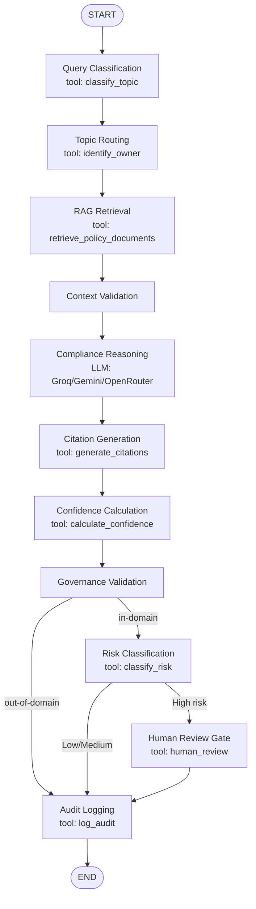

# 🛡️ Aegis — Compliance Advisory & Triage Agent

Aegis is a LangGraph-orchestrated agentic compliance assistant. Every user query executes
through a compiled `StateGraph` (see `agents/orchestrator.py`) — Streamlit never calls the LLM
or a retrieval tool directly. Answers are grounded exclusively in retrieved policy chunks,
governed against hallucination, risk-classified, and routed to the correct compliance owner,
with a human-approval gate for high-risk questions.

## Architecture — LangGraph Flow



## Installation

```bash
python -m venv .venv
# Windows
.venv\Scripts\activate
pip install -r requirements.txt
```

## Configure API keys

Edit `.env`:

```
LLM_PROVIDER=groq
GROQ_API_KEY=your_key_here
GROQ_MODEL=llama-3.3-70b-versatile
GEMINI_API_KEY=your_key_here
GEMINI_MODEL=gemini-2.5-flash
OPENROUTER_API_KEY=
OPENROUTER_MODEL=
SIMILARITY_THRESHOLD=0.65
EMBEDDING_MODEL=all-MiniLM-L6-v2
```

Aegis tries providers in order **Groq → Gemini → OpenRouter** on every request:

- **Groq is primary** — its free tier (30 requests/min, ~1,000 req/day) is far more reliable
  for iterative testing than OpenRouter's free tier (20 req/min, 50 req/day unless $10 in
  credits has been purchased on the account).
- **Gemini 2.5 Flash is the fallback** if Groq is unavailable, rate-limited, or errors out.
- **OpenRouter is optional, third priority.** If `OPENROUTER_API_KEY`/`OPENROUTER_MODEL` are
  left blank, it is skipped cleanly — no error.
- Every `*_MODEL` env var is swappable without touching code — free-tier model rosters rotate
  over time, so no model name is hardcoded as the only option.
- Every provider failure (auth, timeout, network, rate limit) is logged in the Execution Trace
  and automatically falls through to the next provider. The app never crashes because one
  provider failed.

## Add policy documents

Drop PDF/DOCX/TXT files into `data/policies/` — the app scans and ingests **whatever is
physically present** on startup, with no hardcoded filenames or topic mappings. Duplicate
files (by content hash) are skipped automatically. You can also upload a document from the
sidebar and click **Rebuild Index** to re-scan, re-embed, and rebuild the vector store without
restarting the app. If the folder is empty, the UI shows a clear warning.

Any topic not actually covered by the corpus correctly triggers the out-of-corpus refusal path
— this is expected behavior, not a bug.

## Run

```bash
streamlit run app.py
```

## Folder structure

```
Triage_agent/
├── app.py                    Streamlit entrypoint (Chat, Audit Log, Admin Dashboard, Eval Suite)
├── llm_provider.py           Provider abstraction: get_llm_response() with Groq/Gemini/OpenRouter failover
├── .env / requirements.txt
├── agents/
│   ├── orchestrator.py       LangGraph StateGraph definition (the required workflow)
│   ├── router.py             Topic -> owner mapping table
│   ├── compliance_agent.py   Grounded LLM answer generation (temperature 0-0.2)
│   ├── governance_agent.py   Hallucination/evidence/citation validation, refusal logic
│   └── escalation_agent.py   Deterministic Low/Medium/High risk classifier
├── rag/
│   ├── loader.py              PDF/DOCX/TXT loading with page-level metadata
│   ├── splitter.py            RecursiveCharacterTextSplitter (800/150), clause/section detection
│   ├── embeddings.py          sentence-transformers wrapper (EMBEDDING_MODEL env var)
│   ├── vectorstore.py         Chroma persistent client + collection reset for Rebuild Index
│   ├── retriever.py           Top-5 retrieval + SIMILARITY_THRESHOLD filtering
│   └── ingest.py              Corpus scan, dedup-by-hash, chunk, embed, index
├── tools/
│   ├── compliance_tools.py   All 8 required StructuredTools (one per graph node)
│   ├── confidence.py          Deterministic confidence formula
│   └── audit_logger.py        SQLite (database/audit.db) + JSON (logs/audit_log.json) export
├── database/                 audit.db, Chroma persistence, ingested-file hash registry
├── data/policies/            Drop policy documents here
├── logs/audit_log.json
├── ui/                       styles.py (dark theme CSS), components.py (response card, trace panel)
└── tests/eval_suite.py       6 required scenarios + aggregate metrics
```

## Confidence formula

```
Confidence = 70% x avg retrieval similarity (qualifying chunks)
           + 20% x normalized chunk count (min(count,5)/5)
           + 10% x citation coverage
Clamped to 0-100. Computed only from real Chroma relevance scores -- never LLM-estimated.
```

## Governance & refusal

If retrieval similarity is below `SIMILARITY_THRESHOLD`, fewer than 2 qualifying chunks exist
(unless one chunk is a strong, well-margined single-clause match), confidence is below the
minimum, or any paragraph lacks a citation, the drafted answer is discarded entirely and Aegis
returns:

> "I could not find this information in the uploaded compliance corpus. I cannot provide
> regulatory advice without supporting policy. This query has been routed to the Compliance
> Team."

Out-of-domain queries (weather, sports, etc.) get the same refusal text but with no
escalation and no human review gate — RAG retrieval still runs for observability/consistency,
but Compliance Reasoning is skipped.

## Evaluation Suite

Open the **🧪 Evaluation Suite** tab and click **Run Evaluation Suite** to execute all 6
required scenarios (retention lookup, out-of-corpus refusal, cross-border escalation, AML
routing, "ignore GDPR" fairness check, out-of-domain weather query) plus aggregate metrics
(retrieval precision/recall, citation correctness, routing/escalation/refusal accuracy, tool
invocation accuracy, average latency/confidence, hallucination rate).
